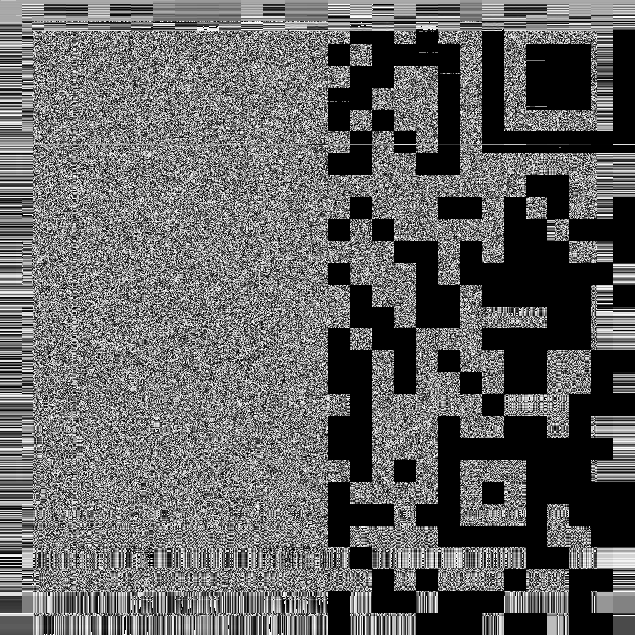
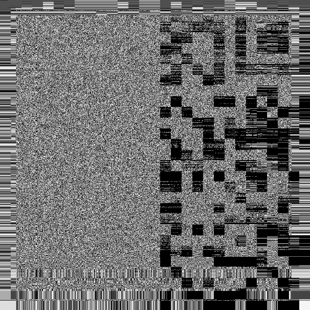
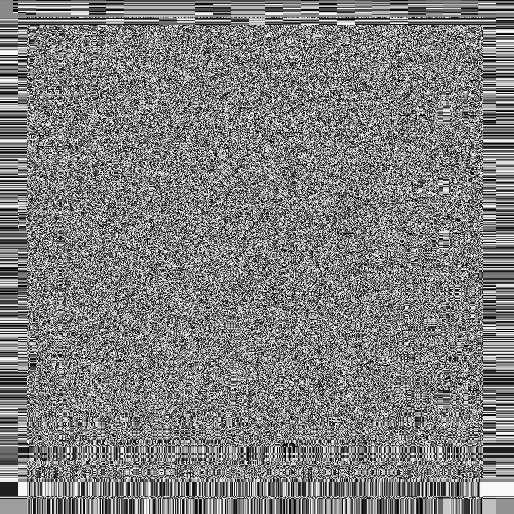
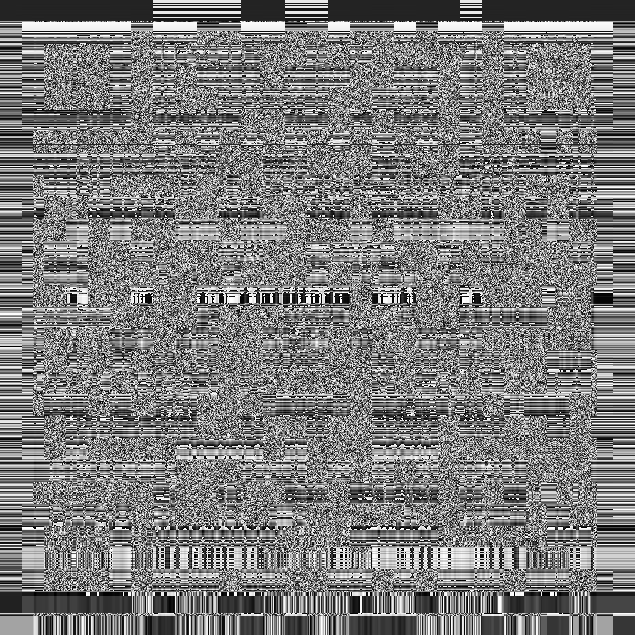
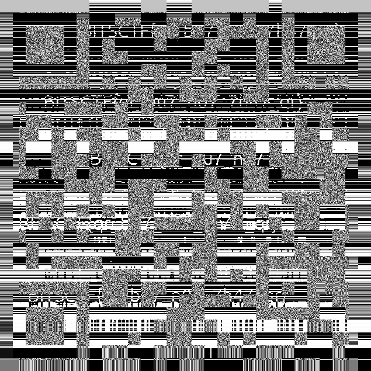
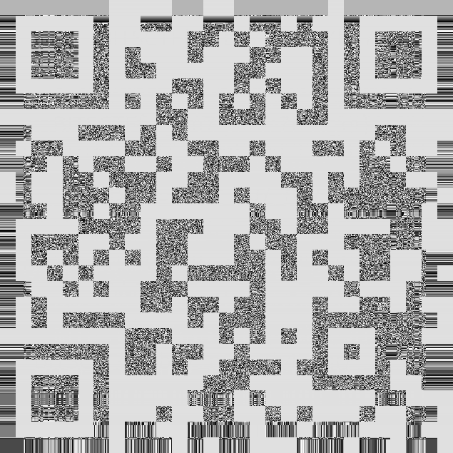
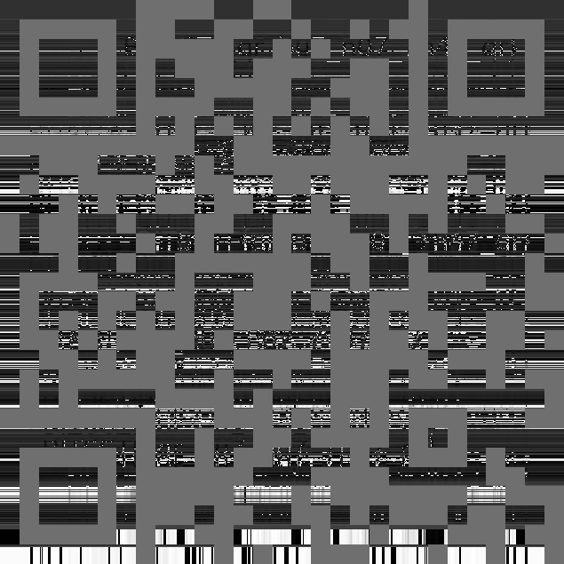
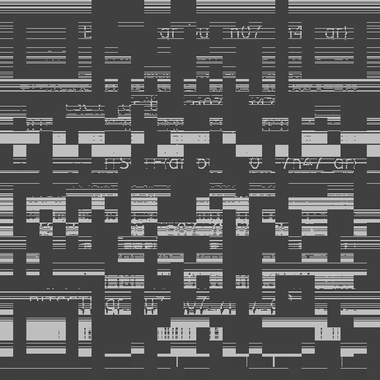
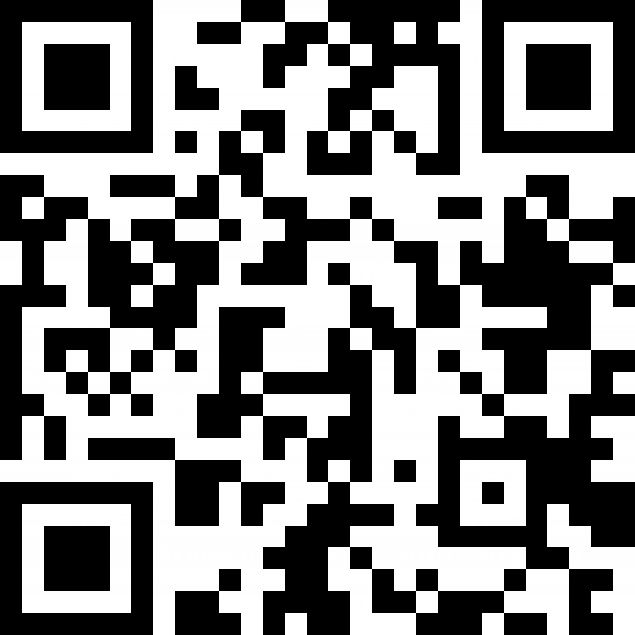
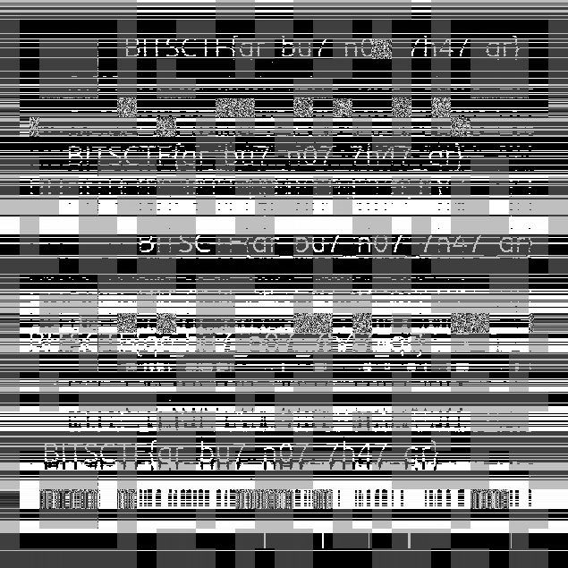

# *Queen Roselia's Diamond**

> This write-up documents a deliberately vulnerable lab / CTF-style service.  
> All techniques are presented for educational purposes only.

---

## Overview

- **Category**: Forensics
- **Difficulty**: Medium
- **Key Concepts**: TIFF Channel Extraction, Grid Analysis, Image Reconstruction, Masking Logic
- **Goal**: Reconstruct a fragmented QR code hidden across multiple TIFF channels to retrieve the valid flag.

---

## Challenge Description

> In 1687, Queen Roselia offered Dr. Oldenburg a residency in her queendom's most prestigious university on one condition: he continue his research on optics. He found a diamond that "decomposes" light into 7 colors: truly a breakthrough. She wore it proudly on her crown, the biggest stone among her crown jewels, where in the rays of the sun that shone through the palace windows, illuminated the court in a rainbow haze.

Source: [queen_roselias_diamond.zip](src/queen_roselias_diamond.zip)

---

## Analysis

### Initial Observation
I started by extracting `queen_roselias_diamond.zip` to get `challenge_stego.tif`. Using `exiftool`, I examined the metadata:

```yaml
File Size                       : 3.2 MB
Image Width                     : 635
Image Height                    : 635
Bits Per Sample                 : 64
Sample Format                   : Float
```

Calculating the file size manually: 635×635×8 bytes=3,225,800.
The metadata shows "Bits Per Sample: 64" and the hint mentions "decomposes light into 7 colors." This suggests the TIFF file contains multiple channels (likely 8 channels of 8-bit data packed into 64-bit chunks, or 8 separate float channels).

I wrote a script (`1_layer_8.py`) to decompose the TIFF into 8 separate images (`layer_0.png` through `layer_7.png`).

| *Layer 0*  |  *Layer 1* |
| ------------------------------------------------------- | ------------------------------------------------------- |
|  *Layer 2* |  *Layer 3* |
|  *Layer 4* |  *Layer 5* |
|  *Layer 6* |  *Layer 7* |


### Rabbit Hole (The Fake Flag)


Upon inspecting the layers, `layer_0` through `layer_7` looked like parts of a QR code. I initially tried scanning the most obvious QR-like layer.



Scanning this returned a fake flag:
`BITSCTF{blud_REALLY_ thought_lmao}`

This confirmed that simple extraction wasn't enough. I noticed `layer_4` and `layer_7` contained different binary data, while `layer_6` contained gray blocks.

---

### Root Cause / Weakness
The challenge relies on **Multi-Channel Steganography** combined with **Grid Resizing Artifacts**.

| Layer 4 | Layer 7 |
| :--------------------------------------------------- | ---------------------------------------------------- |
|                                                      |                                                      |

1. **Split Data**: The real QR code is split between `layer_7` (Base) and `layer_4` (Data Patch).
2. **Selector Mask**: `layer_6` acts as a "Mask." Where `layer_6` is gray, the data must be pulled from `layer_4`. Elsewhere, it stays as `layer_7`.
3. **Resizing Artifacts**: The image is 635×635, but a standard Version 3 QR code is 29×29.

635/29≈21.89

This results in irregular grid sizes (some are 22px, some 21px), making direct pixel-overlay impossible without precise grid analysis.

---

## Key Concepts

### 1. TIFF Channel Extraction

TIFF (Tagged Image File Format) allows for an arbitrary number of channels beyond standard RGB. In this challenge, the image data was hidden in high-index channels (4, 6, and 7) which are often ignored by standard image viewers.

### 2. Grid Analysis & Reconstruction

When pixel art (like a QR code) is upscaled by a non-integer factor (21.8921.89), "aliasing" occurs. To reconstruct the original data perfectly, we cannot just resize the image. We must calculate the exact coordinate boundaries of every logical grid cell (Module) to determine if it is a "21-pixel" or "22-pixel" cell.

---

## Exploitation / Solution

### Step 1 – Grid Analysis

I wrote a script `2_analyze_grid.py` to calculate the exact coordinates of the 29x29 grid. The script identified four distinct cell groups based on dimensions:

```text
[-] Statistics:
    Group 1 (22x22): 676
    Group 2 (21x22): 78
    Group 3 (22x21): 78
    Group 4 (21x21): 9
```

The script saved these coordinates to `grid_metadata.json`.

### Step 2 – Masked Merging

I developed a final solver script that iterates through the JSON coordinates. It checks the **center pixel** of `layer_6`.

- **Logic**: If `layer_6` center is **Gray** (Value ~128), overwrite `layer_7` (Base) with `layer_4` (Patch).

```python
import json
import numpy as np
import tifffile
from PIL import Image
import os

def is_gray(pixel_value):
    """
    Determines if a pixel is 'gray'.
    Assumes Black is near 0 and White is near 255.
    Gray is defined as anything in between (e.g., 50-200).
    """
    return 50 < pixel_value < 200

def merge_with_mask():
    # 1. Load Grid Metadata
    if not os.path.exists('grid_metadata.json'):
        print("[!] Error: 'grid_metadata.json' not found. Run Program 1 first.")
        return

    with open('grid_metadata.json', 'r') as f:
        grid_data = json.load(f)
    print(f"[*] Loaded metadata for {len(grid_data)} grid cells.")

    # 2. Load TIFF Image
    try:
        tiff_data = tifffile.imread('challenge_stego.tif')
    except Exception as e:
        print(f"[!] Error loading image: {e}")
        return

    # 3. Extract Layers
    # Reshape to (H, W, Channels)
    layers = tiff_data.view(np.uint8).reshape(tiff_data.shape[0], tiff_data.shape[1], 8)
    
    L4 = layers[:, :, 4]
    L6 = layers[:, :, 6]
    L7 = layers[:, :, 7]

    # Create the base image (Copy of Layer 7)
    final_image = L7.copy()

    edit_count = 0

    # 4. Iterate through Grid Cells
    for cell in grid_data:
        x = cell['x']
        y = cell['y']
        w = cell['w']
        h = cell['h']
        
        # Calculate Center Point of the cell
        center_x = x + (w // 2)
        center_y = y + (h // 2)

        # Check Layer 6 value at center point
        mask_val = L6[center_y, center_x]

        # Logic: If Layer 6 center is Gray -> Use Layer 4 data
        if is_gray(mask_val):
            # Replace the entire cell region in final_image with L4 data
            final_image[y : y+h, x : x+w] = L4[y : y+h, x : x+w]
            edit_count += 1
        
        # Else: Do nothing (keep Layer 7 data)

    # 5. Save Result
    output_filename = 'merged_L7_base_L6_mask.png'
    Image.fromarray(final_image).save(output_filename)
    
    print(f"[*] Processing complete.")
    print(f"[-] Total cells modified: {edit_count}")
    print(f"[-] Result saved as: {output_filename}")

if __name__ == "__main__":
    merge_with_mask()
```

#### Result:



----

## Key Takeaways

- **Trust the Math, not the Eye**: Visual inspection of the grid was confusing due to 21px/22px variance. Calculating the grid mathematically solved the alignment issues.
- **Check All Channels**: In forensics, data often hides in Alpha channels or extra TIFF layers.
- **Beware of Rabbit Holes**: The first readable flag was a decoy. Always verify if "Noise" (Layer 6) has a structural purpose.