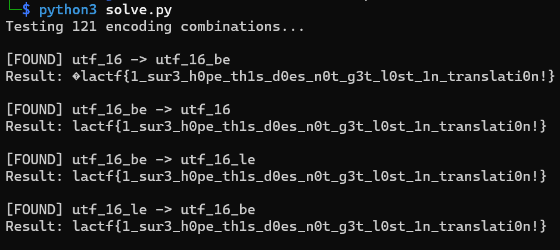

# **endians**

> This write-up documents a deliberately vulnerable lab / CTF-style service.  
> All techniques are presented for educational purposes only.

---

## Overview

- **Category**: Misc
- **Difficulty**: Easy
- **Key Concepts**: Unicode encoding, byte order, encode/decode chaining, endian representation
- **Goal**: Recover the original flag by all encoding and decoding operations

---

## Challenge Description

> ​	I was reading about Unicode character encodings until one day, my flag turned into Japanese! Does little-endian mean the little byte's at the end or that the characters start with the little byte?

---

## Analysis

### Initial Observation
The provided `gen.py` script generates the challenge file using the following logic:

```python
text = "lactf{REDACTED}"
endian = text.encode(encoding="???").decode(encoding="???")
with open("chall.txt", "wb") as file:
    file.write(endian.encode())
```

From this code, we observe:

1. The flag is first encoded using an unknown encoding.
2. The encoded bytes are then decoded using a second encoding.
3. The result is encoded again using UTF-8 and written to a file.

This indicates that the challenge uses multiple encoding layers and requires reversing the transformation.

---

### Root Cause / Weakness

The challenge intentionally performs **UTF-16 endianness misinterpretation**.

UTF-16 represents characters using two bytes per character. When UTF-16 data is decoded using the wrong byte order, each two-byte unit is interpreted incorrectly, producing readable but incorrect characters. This phenomenon is known as **mojibake**.

Because the transformation only swaps byte order rather than destroying data, it is fully reversible. Reapplying the inverse byte interpretation restores the original text.

------

### Key Concepts

#### Unicode Encoding

Unicode assigns each character a numeric code point. Encoding formats determine how those numbers are stored as bytes.

Common encoding formats:

- UTF-8 → Variable length (1-4 bytes)
- UTF-16 → Fixed 2-byte units
- UTF-32 → Fixed 4-byte units

Each encoding stores the same character differently.

------

#### Endianness

Endianness determines how multi-byte values are stored in memory.

- **Little Endian (LE)**
   Least significant byte stored first.
- **Big Endian (BE)**
   Most significant byte stored first.

Example using character `A` (Unicode U+0041):

| Encoding | Byte Representation |
| -------- | ------------------- |
| UTF-16LE | `41 00`             |
| UTF-16BE | `00 41`             |

Swapping these byte pairs changes how characters are interpreted.

------

#### Encoding Chain Reversal

If data is transformed using:

```
encode(A)
→ decode(B)
→ encode(C)
```

The original data can be restored using:

```
decode(C)
→ encode(B)
→ decode(A)
```

The operations must be reversed in the opposite order.

------

### Exploitation / Solution

#### Step 1 – Identify Encoding Behavior

By observing the challenge output, the text appears as readable but incorrect Unicode characters, suggesting UTF-16 byte misinterpretation.

Since UTF-16 operates on two-byte units, swapping endianness is the likely transformation.

------

#### Step 2 – Reverse the Encoding Chain

To recover the flag:

1. Read the stored file as UTF-8 text.
2. Convert the text into bytes using the incorrect encoding.
3. Decode the bytes using the opposite UTF-16 byte order.

------

#### Step 3 – Solver Script

```python
import encodings
import pkgutil

# Get all available encodings
all_encodings = set()
for importer, module_name, is_package in pkgutil.iter_modules(encodings.__path__, ''):
    all_encodings.add(module_name)

# Read file and decode using default UTF-8
with open("chall.txt", "rb") as file:
    data = file.read()

text_str = data.decode()

# Try all encoding and decoding combinations
print(f"Testing {len(all_encodings)} encoding combinations...\n")

for encode_type in sorted(all_encodings):
    for decode_type in sorted(all_encodings):
        try:
            result = text_str.encode(encode_type).decode(decode_type)
            if "lactf{" in result:
                print(f"[FOUND] {encode_type} -> {decode_type}")
                print(f"Result: {result}\n")
        except Exception:
            pass
```



This reverses the endianness mismatch and reveals the original flag.

------

### Key Takeaways

- Encoding transformations can disguise data without encrypting it.
- UTF-16 stores characters using two-byte units, making byte order critical.
- Endianness mismatches often produce readable but incorrect Unicode output.
- Reversing encode/decode chains requires applying operations in reverse order.

------

### References

- Unicode Standard Documentation
- UTF-16 Encoding Specification
- Mojibake and Encoding Mismatch Explanation