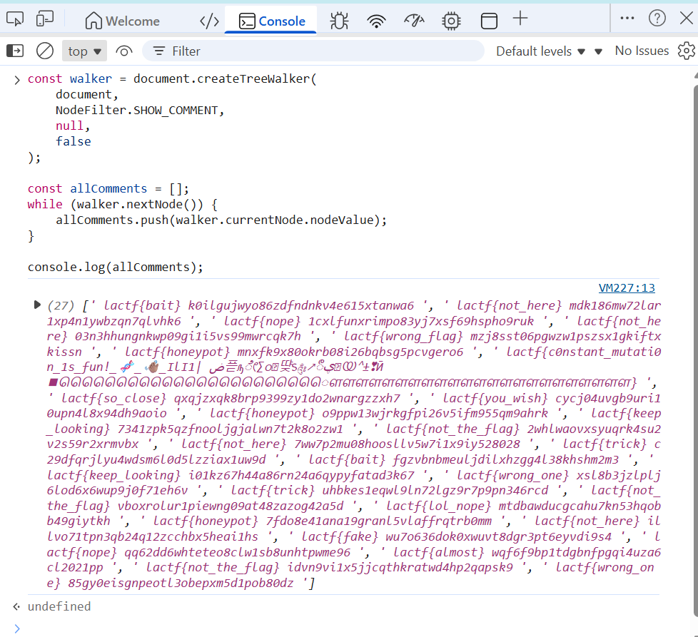

# **mutation mutation**

> This write-up documents a deliberately vulnerable lab / CTF-style service.  
> All techniques are presented for educational purposes only.

---

## Overview

- **Category**: Web
- **Difficulty**: Easy
- **Key Concepts**: DOM Manipulation, TreeWalker API, JavaScript Event Prevention Bypass, HTML Comments Extraction.
- **Goal**: Extract the real flag from constantly mutating HTML comments by circumventing JavaScript keyboard shortcuts restrictions

---

## Challenge Description

> ​	It's a free flag! You just gotta inspect the page to get it. Just be quick though... the flag is constantly mutating. Can you catch it before it changes? 

---

## Analysis

### Initial Observation


When opening the webpage, the UI shows a simple message instructing users to inspect the page. Initial attempts to access developer tools using standard shortcuts such as:

- `F12`
- `Ctrl + Shift + I`
- `Ctrl + U`

fail because JavaScript intercepts keyboard events and disables them.

Downloading the webpage using:

```
wget https://mutation-mutation.chall.lac.tf/
```

reveals the source code, but the flag is not visible. This indicates that the flag is dynamically generated through JavaScript rather than embedded in static HTML.

---

### Root Cause / Weakness

#### 1. Client-Side Protection Only

The page relies entirely on JavaScript event listeners to block user actions such as:

- Opening DevTools with keyboard shortcuts
- Copying page content
- Using the right-click menu

However, JavaScript operates only within the webpage execution context. It **cannot block browser-level UI controls**, such as opening DevTools via the browser menu.

#### 2. Dynamic Comment Injection

The page continuously executes a function named `mutateComment()` which:

- Removes all comments containing flag-like patterns
- Generates 1–100 new comments
- Inserts fake flags
- Inserts exactly one real flag
- Repeats every 50ms

Because the flag is always present in the DOM (even if briefly), it can be extracted by quickly scanning comment nodes.

---

## Key Concepts

### DOM Traversal and Comment Nodes

HTML comments (`<!-- comment -->`) are stored as `Comment` nodes in the DOM tree. These nodes are not accessible via standard element selectors and must be accessed using DOM traversal APIs.

Important property:

```
node.nodeValue
```

This property retrieves the actual text inside the comment.

------

### TreeWalker API

The `TreeWalker` API allows efficient traversal of specific node types within the DOM.

Example:

```javascript
document.createTreeWalker(
    document,
    NodeFilter.SHOW_COMMENT,
    null,
    false
);
```

This instructs the browser to traverse only comment nodes across the entire document.

TreeWalker is efficient because it:

- Skips unnecessary nodes
- Iterates sequentially
- Provides direct access to comment content

------

### Bypassing JavaScript Restrictions

JavaScript blocks keyboard shortcuts using:

```javascript
document.addEventListener('keydown', ...)
```

However, browser UI elements operate independently of webpage JavaScript. DevTools can still be opened through browser menus.

---

## Exploitation / Solution

### Step 1 – Open DevTools via Browser Menu

Since keyboard shortcuts are blocked, DevTools must be opened using browser UI.

Example (Chrome / Edge):

```
⋮ → More Tools → Developer Tools
```

Example (Firefox):

```
≡ → More → Web Developer Tools
```

------

### Step 2 – Extract All Comment Nodes

After opening DevTools, navigate to the **Console** tab and execute:

```javascript
const walker = document.createTreeWalker(
    document,
    NodeFilter.SHOW_COMMENT,
    null,
    false
);

const allComments = [];
while (walker.nextNode()) {
    allComments.push(walker.currentNode.nodeValue);
}

console.log(allComments);
```



----

## Step 3 — Filter Fake Flags and Identify the Real Flag

### Explanation

The comment output contains both **fake flags** and **one real flag**.
 The fake flags can be identified because they always contain specific misleading keywords defined in the webpage script.

The script uses the following keyword list to generate fake flags:

```javascript
const fakeWords = [
    'fake', 'wrong', 'nope', 'try_again', 'nice_try', 'not_here',
    'keep_looking', 'almost', 'so_close', 'decoy', 'honeypot',
    'red_herring', 'wrong_flag', 'not_the_flag', 'fake_flag',
    'you_wish', 'lol_nope', 'trick', 'bait', 'wrong_one'
];
```

Therefore, the real flag can be extracted by:

1. Searching for comments containing `lactf{`
2. Excluding any comment that contains the fake keywords


Flag:

```
lactf{с0nѕtаnt_mutаtі0n_1s_fun!_🧬_👋🏽_ІlІ1| ض픋ԡೇ∑ᦞ୞땾᥉༂↗ۑீ᤼യ⌃±❣Ӣ◼ௌௌௌௌௌௌௌௌௌௌௌௌௌௌௌௌௌௌௌௌௌௌௌ}
```

---

## Key Takeaways

- Client-side JavaScript protections are not reliable security mechanisms.
- DOM comment nodes can contain hidden data and require specialized traversal techniques.
- TreeWalker provides an efficient method for targeted DOM inspection.
- Mutation-based challenges rely on speed and snapshot extraction rather than static analysis.
- Browser UI access often bypasses client-side restriction logic.

------

## References

- Mozilla Developer Network — TreeWalker API
- Mozilla Developer Network — NodeFilter
- Mozilla Developer Network — Comment Nodes
- OWASP — Client-Side Security Limitations