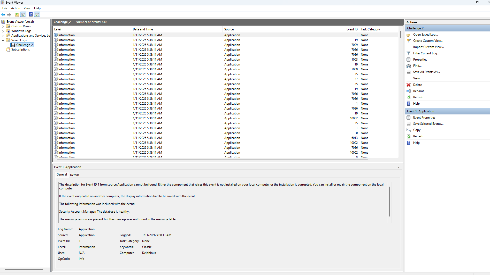
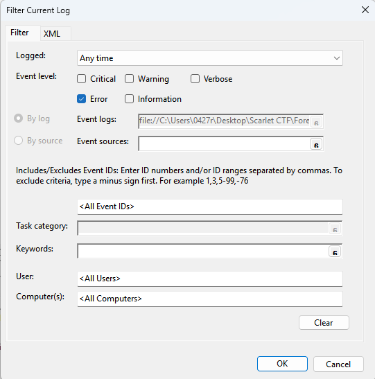

# **:(**

> This write-up documents a deliberately vulnerable lab / CTF-style service.  
> All techniques are presented for educational purposes only.

------

## Overview

- **Category**: Windows Event Log Analysis
- **Difficulty**: Medium
- **Key Concept**: Offline EVTX parsing, Event ID filtering
- **Goal**: Analyze Windows Event Viewer logs to locate the single meaningful Base64 string hidden in each event group, and combine them to recover the full flag.

## Challenge Description

> As I look back at my RUSEC memories, I remembered the time that I met my mentor.
>  It seems like he accidentally kept sending my machine a payload that caused my screen to go blue…

## 1. Analysis

- Windows Event Log files (**EVTX**) are **structured binary logs**, not plain text.
   This means blind string searching is unreliable; analysis must respect the event structure.

  Based on the challenge description and common Windows behavior, the following **Event IDs** are relevant:

  - **1001** — BugCheck (system reboot after a BSOD)
  - **41** — Kernel-Power (system did not shut down cleanly)
  - **6008** — Previous system shutdown was unexpected

  Each Event ID group contains many events, but **only one event per group contains meaningful data**.
  
  ### 2. Offline EVTX Parsing (Event Viewer)

#### Step 1: Load the EVTX file

I analyzed the provided EVTX file using the built-in **Windows Event Viewer**.

#### Step 2: Filter relevant events

Using **Filter Current Log**, select:

- **Level**: Error

#### Step 3: Identify suspicious events

After filtering, multiple error events appear.

Then, We can find two abnormal binary data size

Decoding these two outliers will yield the flag!!d(`･∀･)b

## Key Takeaways

- EVTX files must be analyzed as **structured data**, not plain text
- **Event ID filtering** is critical to reduce noise
- **Abnormally small Binary data** in system events is a strong indicator of hidden payloads
- Understanding **Windows crash semantics** greatly simplifies forensic analysis

## References

- Microsoft Documentation — Windows Event Logging
- EVTX File Format Overview